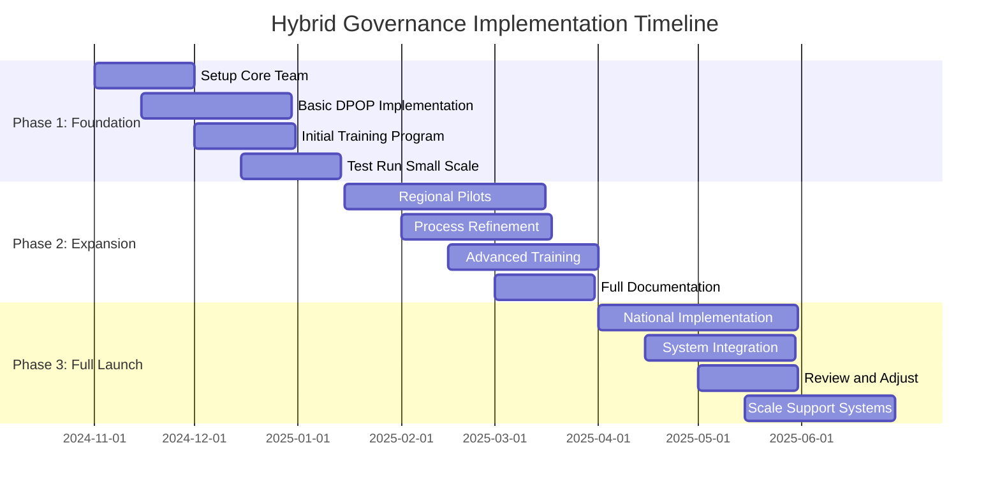

Here's how we could begin:




Here's how we could begin:

1. **Phase 1: Foundation (First 3 Months)**

Immediate Actions:
- Form an Implementation Working Group (IWG)
- Select pilot local chapter(s)
- Set up basic DPOP infrastructure

Week 1-2:
- Establish the IWG with representatives from:
  * Technical team
  * Current leadership
  * Local chapters
  * Member advocates
  * Process experts

Week 3-4:
- Initial training sessions
- Set up basic digital infrastructure
- Create documentation templates

Week 5-8:
- Begin with simple test cases:
  * One local issue (self-organizing mode)
  * One party-wide vote (democratic mode)
  * One technical decision (consensus mode)
  * One simulated crisis (leader-led mode)

Week 9-12:
- Collect feedback
- Refine processes
- Adjust technical systems
- Update documentation

2. **Key Success Metrics for Phase 1:**

```javascript
const phase1Metrics = {
  participation: {
    target: "30% active member engagement",
    minimum: "20% participation in test cases"
  },
  timeEfficiency: {
    democratic: "Decision within 2 weeks",
    leaderLed: "Response within 24 hours",
    consensus: "Resolution within 1 month",
    selfOrganizing: "Initiative launch within 1 week"
  },
  satisfaction: {
    members: "70% approval rating",
    leaders: "80% process confidence",
    technical: "90% system uptime"
  }
}
```

3. **Critical Points to Monitor:**

- Technical system stability
- User experience feedback
- Process clarity
- Resource requirements
- Communication effectiveness
- Decision quality
- Member engagement

4. **Initial Focus Areas:**

a) **Technology Setup**
- Basic DPOP implementation
- Essential security measures
- Simple user interfaces
- Backup systems

b) **Training Development**
- Core process understanding
- Tool usage
- Role responsibilities
- Problem-solving procedures

c) **Documentation**
- Process guides
- User manuals
- Decision records
- Evaluation forms

5. **Common Early Challenges to Prepare For:**

- Tool adoption resistance
- Process confusion
- Technical glitches
- Communication gaps
- Role uncertainty
- Scope creep

6. **Support Systems Needed:**

- Technical helpdesk
- Process mentors
- Documentation team
- Feedback channels
- Training resources

Would you like me to elaborate on any of these aspects or discuss specific strategies for addressing potential challenges? We could also dive deeper into:

1. Detailed technical setup requirements
2. Training program content
3. Communication strategy
4. Risk mitigation approaches
5. Specific process templates

