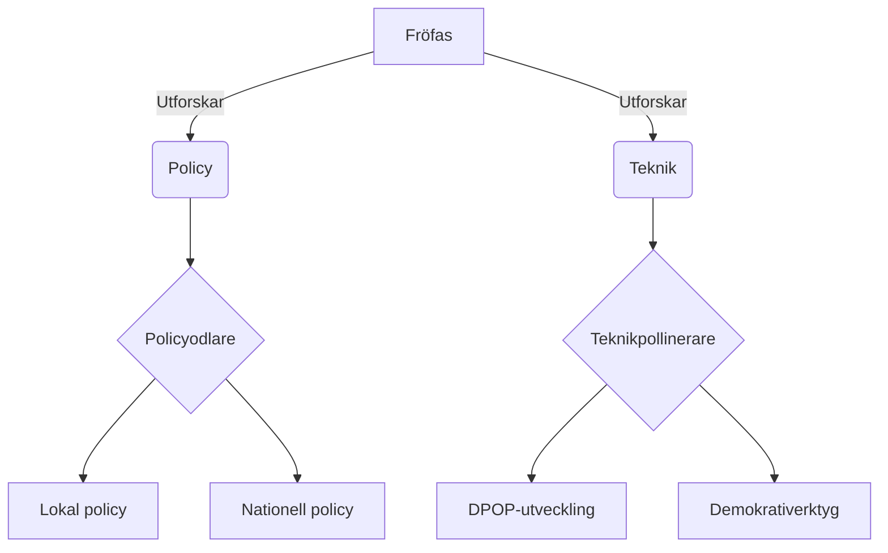

# MED-108  
---  
dokumentid: MED-108  
titel: Engagemangsväg & Medlemsutveckling  
version: 2.0  
senast-uppdaterad: 2024-11-01  
ansvarig: [Namn]  
roll: Medlemskoordinator  
relaterade-dokument:  
  - MED-101 # Komma igång  
  - MED-102 # Organisera möten  
  - MED-104 # Lokala initiativ  
  - TAK-105 # Intern demokrati  
  - OPS-202 # Kommunikationsstrategi  
---  

# Engagemangsväg & Medlemsutveckling  
## Fjärilspartiets organiska tillväxtmodell  

### Sammanfattning  
Denna guide beskriver en **flexibel men strukturerad** väg för medlemsengagemang, anpassad efter Fjärilspartiets värderingar om autonomi, systemtänk och meningsfull tillväxt. Bygger på principerna från MED-101 och praktiska verktyg från MED-102/MED-104.  

---

## Grundprinciper  

### 1. **Blomstrande Ekologi**  
- Varje medlem är som en unik fjäril som bidrar till helheten  
- Vägar anpassas efter:  
  - Livssituation (tid/energi)  
  - Kompetensområden  
  - Personliga mål  
  - Lokala behov  

### 2. **Systemisk Tillväxt**  
- Koppling mellan individuell utveckling och kollektiv framgång  
- "Metamorfos-stöd" vid fasövergångar  

### 3. **Mönster från Naturen**  
- **Rotnätverk:** Grundläggande stöd för alla  
- **Mykorrhiza:** Kunskapsutbyte mellan medlemmar  
- **Pollinering:** Korsbefruktning av idéer  

---

## Fyra Växtfaser  

### 🌱 **Fröfasen: Upptäckande (0-3 månader)**  
**Mål:** Skapa trygghet och orientering  

#### Aktiviteter (välj 1+):  
- Delta i **Välkomstcafé** (hybridformat)  
- Genomför **Självguidead tur** i DPOP  
- Välj 2 **Kärndokument** att utforska (t.ex. STR-104 + AUBI-policy)  
- Boka **Välkomstsamtal** med mentor  

#### Stöd:  
- "Frökit" digitalt paket med:  
  - Interaktiv karta över engagemangsmöjligheter  
  - 3 färdiga "smakprov"-aktiviteter  
  - Personlig kontaktlista  

*Länkar till MED-101, avsnitt 2-3*  

---

### 🌿 **Skottfasen: Rotfäste (3-12 månader)**  
**Mål:** Hitta sin primära näringsbärare  

#### Vägval:  
1. **Policyodlare**  
   - Forskningscirklar (MED-105)  
   - Pilotprojektevaluering  

2. **Samhällsträdgårdsmästare**  
   - Lokala initiativ (MED-104)  
   - Nätverksbyggande  

3. **Teknisk pollinerare**  
   - DPOP-utveckling (MED-103)  
   - Demokrativerktyg  

4. **Kommunikationsväxt**  
   - Sociala medie-team  
   - Grafisk storytelling  

#### Utvecklingsverktyg:  
- **Månatlig "Växtjournal"** i DPOP:  
  - Reflektioner  
  - Kunskapsökningar  
  - Kontaktnät  

*Exempel från MED-104, bilaga 2*  

---

### 🌸 **Blomfasen: Bidragande (1-2 år)**  
**Mål:** Fullt integrerad i partisystemet  

#### Roller:  
- **Projektfruktbärare:** Led små initiativ  
- **Kunskapspollinerare:** Utbilda nyare medlemmar  
- **Systemträdgårdsmästare:** Koordinator för lokalt kapitel  

#### Stödstruktur:  
- **Kvartalsvis "Trädgårdsrundvandring"**  
  - Peer-feedback  
  - Resursjustering  
  - Karriärvägssamtal  

*Relaterar till TAK-105 om hybridstyrning*  

---

### 🍂 **Fröbärande Fas (2+ år)**  
**Mål:** Sprida kunskap och säkerställa kontinuitet  

#### Möjligheter:  
- **Strategisk rådgivare**  
- **Rikstäckande koordinator**  
- **Internationell kontaktväxt**  
- **Metodutvecklare**  

#### Årligen:  
- **"Fröbank"-bidrag:** Dokumentera och systematisera erfarenheter  
- **Mentorskap:** 1-3 nyblivna medlemmar  

---

## Adaptiva Stödsystem  

### 1. **Digital Växthusmiljö (DPOP)**  
- **Engagemangskartor:** Visar möjliga vägar  
- **Kompetensnätverk:** Matchar efter färdigheter  
- **Projektodlingar:** Små testbäddar  

*Se OPS-102 för teknisk implementation*  

### 2. **Återkommande Ritualer**  
- **Våroffensiv:** Årlig engagemangsfestival  
- **Skördefest:** Uppskattning av bidrag  
- **Vintervila:** Reflektionsperiod  

### 3. **Krisstöd**  
- **Omgrupperingsteam:** Vid överbelastning  
- **Föryngringskurer:** Rollbyte vid utbrändhet  

---

## Bilagor  

### Bilaga 1: Växtjournalmall  
```markdown 
# [Månad] Växtjournal  

1. **Näring jag fått:**  
   - Kunskap:  
   - Kontakter:  
   - Upplevelser:  

2. **Frön jag sått:**  
   - Projektbidrag:  
   - Ideér:  
   - Samarbeten:  

3. **Väderförhållanden:**  
   - Utmaningar:  
   - Stödbehov:  
```

### Bilaga 2: Engagemangskarta (Exempel)  


---

> *"Som i en levande skog behöver olika växter olika förutsättningar - vår styrka ligger i mångfalden av bidrag."*  
> — Fjärilsramverket (STR-104)  

